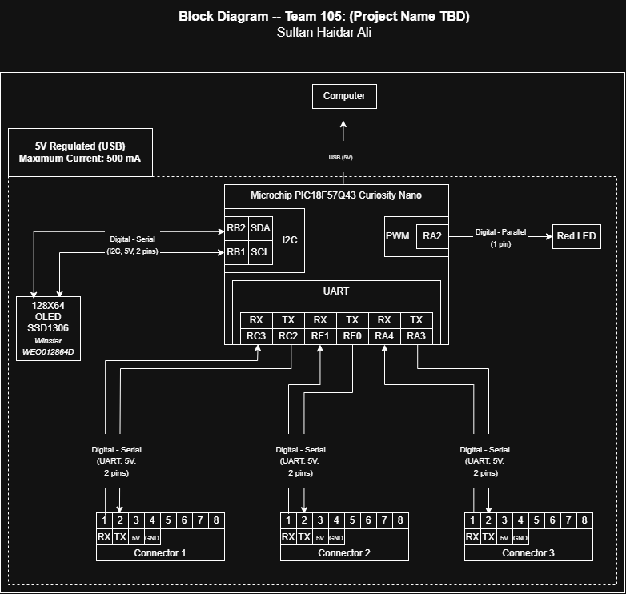

## Overview

The block diagram below illustrates the electrical architecture of the
individual subsystem. The subsystem uses a Microchip PIC18F57Q43
Curiosity Nano as the primary microcontroller. The system is powered
from a 5 V supply provided through the computer's USB connection.

The PIC18F57Q43 communicates with a 128x64 OLED display using I2C
and provides a digital output for the red LED. Three UART interfaces
provide enable communication between the subsystem and other subsystems of the
project. This subsystem serves as the central hub of the team's hub-and-spoke architecture

## Example Block Diagram 
Showing an example of how to import a screenshot of the block diagram created outside of git and brought into a page.

